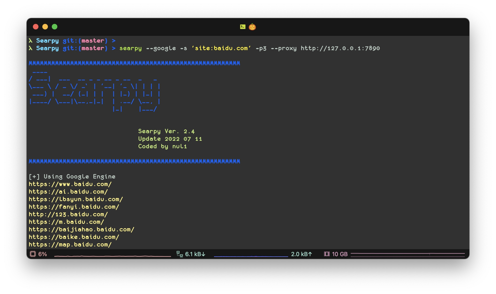
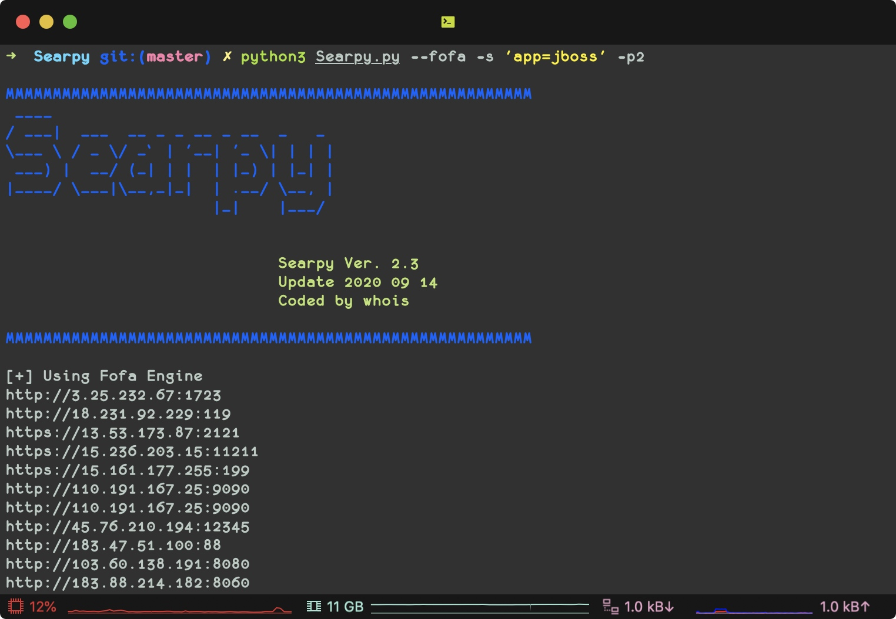

# 🥀 Searpy  [](http://www.python.org/download/) [](http://www.python.org/download/) 

🔧 批量搜索工具，可用于采集和溯源

> 支持py2和py3




## 1. Install
```
git clone https://github.com/j3ers3/Searpy
pip install -r requirements.txt

配置API及账号 ./config.py

python Searpy -h
```


## 2. Help
```
Searpy Engine Tookit

optional arguments:
  -h, --help            show this help message and exit

ENGINE:
  --baidu               Using baidu Engine
  --google              Using google Engine
  --so                  Using 360so Engine
  --bing                Using bing Engine
  --shodan              Using shodan Engine
  --fofa                Using fofa Engine
  --zoomeye             Using zoomeye Engine
  --goo                 Using goo Engine
  --yahoo               Using yahoo Engine
  --quake               Using quake Engine
  --hunter              Using hunter Engine

SCRIPT:
  --shodan_icon SHODAN_ICON
                        Get ip list which using the same favicon.ico
  --fofa_icon FOFA_ICON
                        Get ip list which using the same favicon.ico

MISC:
  -s SEARCH             Speciy Keyword
  -o OUTPUT             Specify output file default output.txt
  -p PAGE               Search page (default 1)
  -l LIMIT              Maximum searching results (default:10) Only Shodan
  --proxy PROXY         HTTP Proxy, eg http://127.0.0.1:8080
```

### 2.1 示例
```
python3 Searpy.py --fofa -s "app=jboss" -p10
python3 Searpy.py --shodan -s "weblogic" -l10 
python3 Searpy.py --quake -s 'domain="baidu.com"'
python3 Searpy.py --hunter -s 'domain="baidu.com"'

python3 Searpy.py --bing -s 'site:baidu.com'
python3 Searpy.py --google -s "inurl:login.action" -p1 --proxy http://127.0.0.1:1080

```




###  2.2 其他功能
利用favicon.icon图标hash来寻找使用相同图标的网站，可用于溯源真实IP和资产发现

```
python3 Searpy.py --shodan_icon https://www.qq.com
python3 Searpy.py --fofa_icon https://www.qq.com
```


## 3. 模块调用
```python
>>> from Searpy import Bing
>>> s = Bing('inurl:php?id=1', 2)
>>> s.search()
>>> for i in s.result:
>>>     print(i)
```

## 4. 支持搜索引擎
- [x] Shodan
- [x] Fofa
- [x] Zoomeye
- [ ] Censys
- [ ] Dnsdb
- [x] Google
- [x] Baidu
- [x] Bing
- [x] 360so
- [x] Goo
- [x] Yahoo
- [x] Quake
- [x] Hunter

## 5. ToDo
- [ ] 添加子域名搜索

## 6. ChangeLog
#### v2.3 
- fix some bugs
- add fofa_icon module

#### v2.2 
- fix some bugs

## 7. Donations
* XMR: `498AoZRwfC11Fa4LwAyVVp3wRD4Zyf1e1HziegczeWeSYVVTZ8gw8CoNPm5yhY91tkDqDMBg6A5KUfyowMtdkQDrDxE5aVN`
* BTC: `1ALWC7rGL4dHgbyy4R8uTVHmDugPDD7Rvt`

