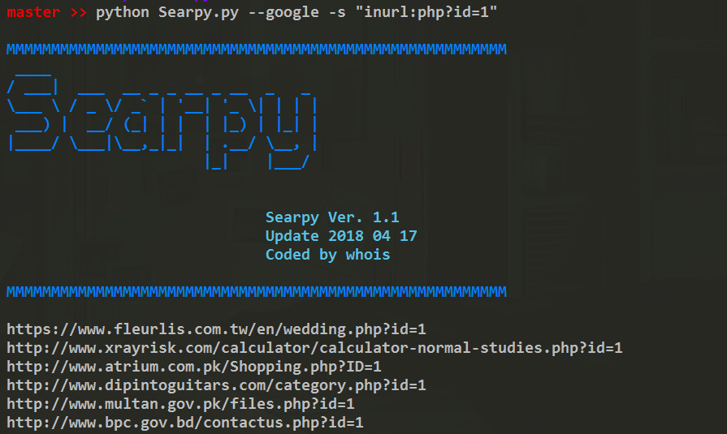
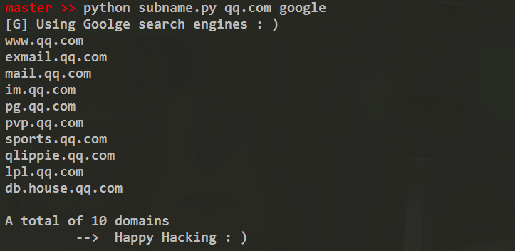

# Searpy  [](http://www.python.org/download/) 

批量搜索脚本，新增Baidu、Google、360SO、Bing、Zoomeye，用于渗透中采集。

</img>

## Help menu
```
Options:
  --version             show program's version number and exit
  -h, --help            show this help message and exit
  -z, --zoomeye         Using zoomeye search
  -b, --baidu           Using baidu search
  -g, --google          Using google search
  -x, --360so           Using 360so search
  -i, --bing            Using bing search
  -s SEARCH, --search=SEARCH
                        Specify Keyword
  -o OUTPUT, --output=OUTPUT
                        Specify output file default output.txt
  -t TYPE1, --type=TYPE1
                        Zoomeye Search Type default [web],[host]
  -p PAGE, --page=PAGE  Search Engine page default 2    
```

## Command
*执行命令模式命令如下*:
```
   python Searpy.py --google -s "inurl:php?id=1" -p 1 -o output.txt

   python Searpy.py -z -s "app:wordpress" -t web -p 10 -o output.txt
```
>Google 使用ShadowSocks，本地默认端口1080

>[Zoomeye](https://www.zoomeye.org/api) 需要access_token

*模块调用*:
```python
  from Searpy import baidu

  for url in baidu('powered by discuz', 1)：

    exp(url)
```

*子域名搜索*:
```
    python subname.py qq.com google
```


## Donations
* XMR: `498AoZRwfC11Fa4LwAyVVp3wRD4Zyf1e1HziegczeWeSYVVTZ8gw8CoNPm5yhY91tkDqDMBg6A5KUfyowMtdkQDrDxE5aVN`
* BTC: `1ALWC7rGL4dHgbyy4R8uTVHmDugPDD7Rvt`

## Contact
- [Twitter](https://twitter.com/j3ers3)
