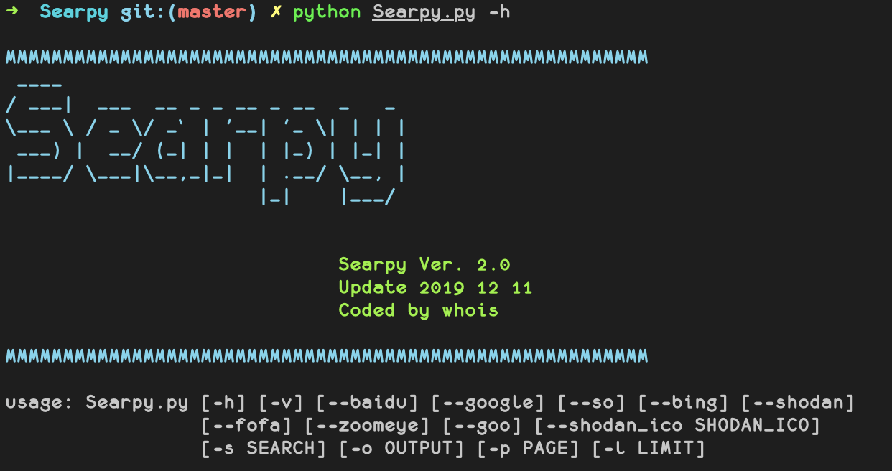
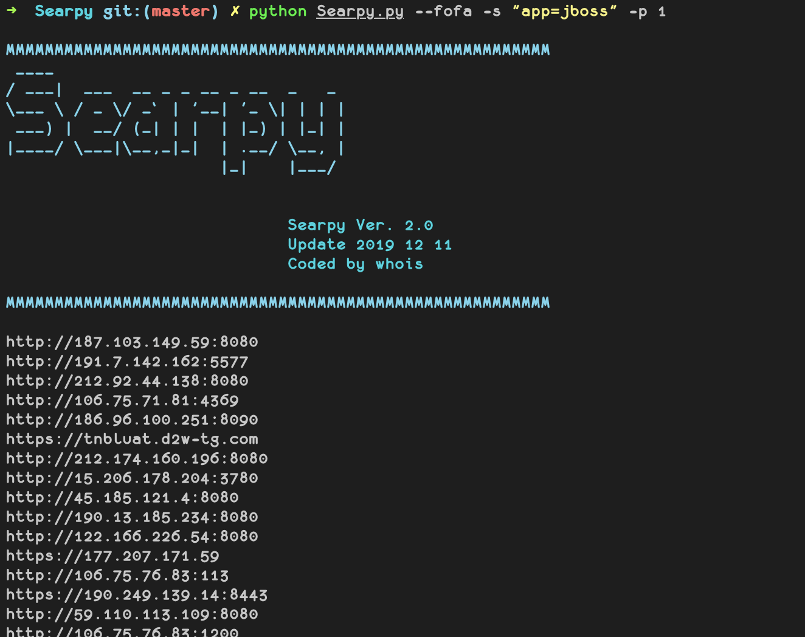
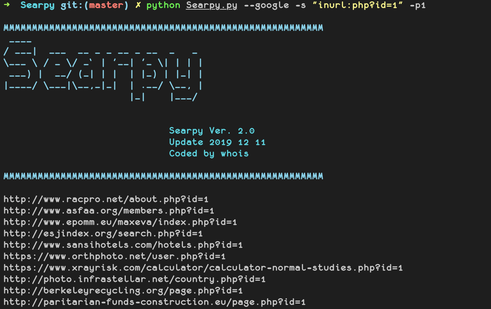
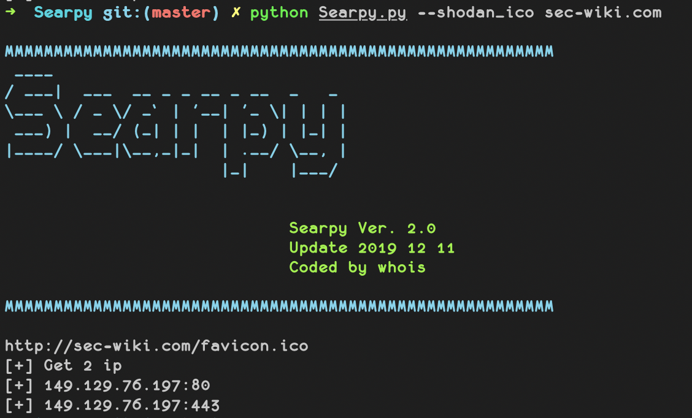

# 🥀 Searpy  [](http://www.python.org/download/) [](http://www.python.org/download/) 

🔧 批量搜索工具，可用于采集和溯源

> 支持py2和py3



## Install
```
git clone https://github.com/j3ers3/Searpy
pip install -r requirement.txt

配置API账号 ./util/config.py

python Searpy -h
```


## Help
```bash
python Searpy.py --fofa -s "app:jboss" -p 1

python Searpy.py --shodan -s "weblogic" -l 10 

python Searpy.py --google -s "inurl:login.action" -p 1

```





## 其他功能
利用Shodan网站图标hash来寻找使用相同图标的网站，可用于溯源真实IP和资产发现

`python Searpy.py --shodan_ico https://www.qq.com`




## 模块调用
```python
>>> from Searpy import Bing
>>> s = Bing('inurl:php?id=1', 2)
>>> s.search()
>>> for i in s.result:
>>>     print(i)
```

## 搜索引擎
- [x] Shodan
- [x] Fofa
- [x] Zoomeye
- [ ] Censys
- [ ] Dnsdb
- [x] Google
- [x] Baidu
- [x] Bing
- [x] 360so
- [x] Goo
- [x] Yahoo

## ToDo
- [ ] 添加子域名搜索

## Donations
* XMR: `498AoZRwfC11Fa4LwAyVVp3wRD4Zyf1e1HziegczeWeSYVVTZ8gw8CoNPm5yhY91tkDqDMBg6A5KUfyowMtdkQDrDxE5aVN`
* BTC: `1ALWC7rGL4dHgbyy4R8uTVHmDugPDD7Rvt`

## Contact
- [Twitter](https://twitter.com/j3ers3)
